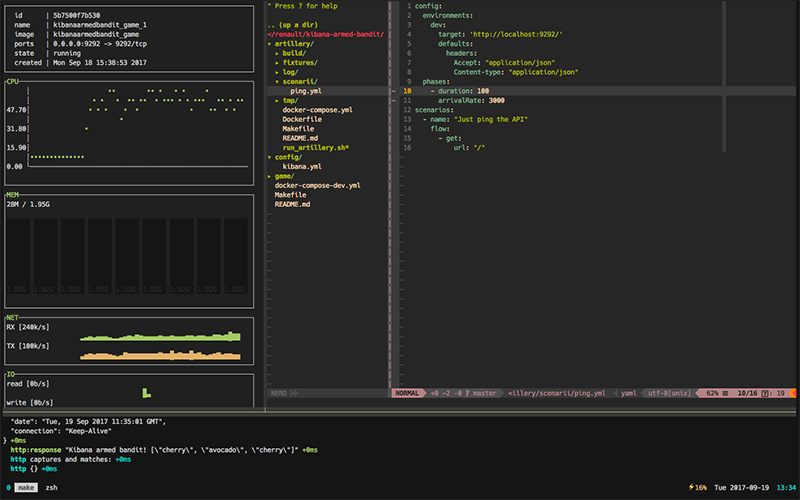
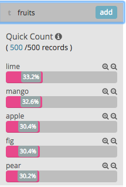
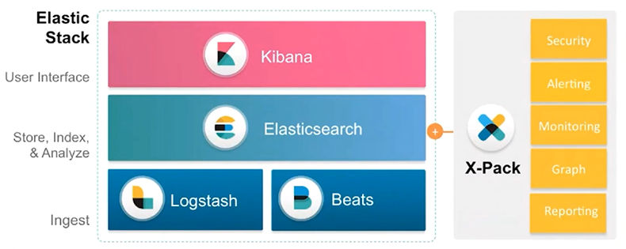

Kibana Armed Bandit
===================

**Logging** is key in every setup: having useful logs from the components in your
environment is your best tool in order to diagnosis issues and keep track of
your applications health.

Docker-based deployments are no exception to the rule. In this training we will
evaluate Kibana features, upon reaching an **Elastic** stack.

Dependencies & Pre-requisites
-----------------------------

- [docker](https://docs.docker.com/engine/installation/)
- [docker-compose](https://docs.docker.com/compose/install/)
- [make](https://en.wikipedia.org/wiki/Make_(software))
- [ngrok](https://ngrok.com/download) (optional)
- [your brain](https://imgur.com/gallery/tX8UN) (not optional)


Ensuring the following ports are free on the host, as they are mounted by the containers:

    - `5601` (Kibana)
    - `9200,9300` (Elasticsearch)
    - `9292` (Bandit application)

### Supported versions

The images have been tested on Docker 17.09.0-ce-rc1 and docker-compose 1.16.1
The docker-compose file uses docker-compose v2.1 syntax.
All Elastic Stack components are version 5.6.1, see `.env` file.

Architecture
------------

The following illustrates the architecture deployed by the compose file. All components are deployed to a single machine.


Installation
------------

**Docker**, the new trending containerization technique, is winning hearts with its
lightweight, portable, "build once, configure once and run anywhere" functionalities.

To run this project on your computer you only need Docker, you probably already
know this technology. In case you don't we have written a training
[here](https://git.renault-digital.com/common/training/blob/master/docker/docker-intro-part1.md).
You can find the documentation about how to install the docker engine
[here](https://docs.docker.com/engine/installation/) on the docker official website.

You don't like Docker, huh?
Downloads the Elastic stack without Docker just here:

- [https://www.elastic.co/downloads](https://www.elastic.co/downloads)

Everything Ok...? Let's start!

Usage
-----

**Makefiles** are a simple way to organize commands, to see this project useful
system commands run `make help`

1 - Start the testing stack

This docker-based [stack](docker-compose-dev.yml) is composed by the following components:

- ruby application aka bandit game
- Elasticsearch as a single node
- Filebeat (logs shipper)
- Kibana


> Hum... I have to just run `make start` ?
>> Yeah!

So, the ruby rack based application can be reached by curl and should return a random
arrays of fruits!


If you want to learn how to start an **Elasticsearch** cluster with Docker, take a look at
this [page](https://www.elastic.co/guide/en/elasticsearch/reference/current/docker.html).
The [docker-compose-dev.yml](docker-compose-dev.yml) file start Elasticsearch
as single node mode. Xpack security extension activation is not included.

**Filebeat** will ship your logs to this Elasticsearch container. To learn more on how Filebeat
works and how to configure your `harvesters` and `prospectors` take a look at
this [page](https://www.elastic.co/guide/en/beats/filebeat/current/how-filebeat-works.html)

2 - Open your Kibana

If you use the docker compose [file](docker-compose-dev.yml) a configured container with Kibana can be
find at this URL [http://localhost:5601/](http://localhost:5601/)

You can optionally give an internet access to your local Kibana by using [Ngrok](https://ngrok.com/).
If **ngrok** is installed on your laptop and you want to share a dashboard, just run `make proxy-kibana`.

/!\ As you can see you create an index... So run `script/create-index` and fill the
form with `bandit` as index name.

3 - Stress your application

> Now, it's time to generate traffic :)

To generate logs and stress the ruby sample application, I use [artillery](https://artillery.io/).
It's a modern load testing toolkit written in Node.js. It's easy to define
**scenarii** with the `yaml` syntax. If you’re new to Artillery, [Getting Started](https://artillery.io/docs/getting-started)
is a good place to start, followed by an overview of [how Artillery works](https://artillery.io/docs/basic-concepts).
I wrapped all the things you need to run the load tests in the Docker containers.

```
cd artillery
make build # generate an artillery container
make ping # start a very minimal ping scenario
```
More infos about the artillery in the [README](artillery/README.md) and commands in the `Makefile`



The app generate logs in JSON format`log/bandit.log`.

```
{"name":"rackup","hostname":"1b44bda82cb3","pid":5,"level":30,"time":"2017-09-22T05:24:30.307+00:00","v":0,"msg":"No message","fruits":["pomelo","cherry","coconut"]}
{"name":"rackup","hostname":"1b44bda82cb3","pid":5,"level":30,"time":"2017-09-22T05:24:30.318+00:00","v":0,"msg":"No message","fruits":["apple","pear","apple"]}
{"name":"rackup","hostname":"1b44bda82cb3","pid":5,"level":30,"time":"2017-09-22T05:24:30.319+00:00","v":0,"msg":"No message","fruits":["fig","avocado","fig"]}
{"name":"rackup","hostname":"1b44bda82cb3","pid":5,"level":30,"time":"2017-09-22T05:24:30.375+00:00","v":0,"msg":"No message","fruits":["lime","banana","fig"]}
{"name":"rackup","hostname":"1b44bda82cb3","pid":5,"level":30,"time":"2017-09-22T05:24:30.404+00:00","v":0,"msg":"No message","fruits":["lime","pear","apple"]}
{"name":"rackup","hostname":"1b44bda82cb3","pid":5,"level":30,"time":"2017-09-22T05:24:30.427+00:00","v":0,"msg":"No message","fruits":["fig","cherry","pomelo"]}
{"name":"rackup","hostname":"1b44bda82cb3","pid":5,"level":30,"time":"2017-09-22T05:24:30.449+00:00","v":0,"msg":"No message","fruits":["apple","fig","cherry"]}
{"name":"rackup","hostname":"1b44bda82cb3","pid":5,"level":30,"time":"2017-09-22T05:24:30.475+00:00","v":0,"msg":"No message","fruits":["cherry","pomelo","pear"]}
{"name":"rackup","hostname":"1b44bda82cb3","pid":5,"level":30,"time":"2017-09-22T05:24:30.507+00:00","v":0,"msg":"No message","fruits":["mango","pear","pomelo"]}
{"name":"rackup","hostname":"1b44bda82cb3","pid":5,"level":30,"time":"2017-09-22T05:24:30.547+00:00","v":0,"msg":"No message","fruits":["lime","cherry","coconut"]}
```

The Filebeat [configuration](config/filebeat.yml) is here to parse the JSON format and send the data to Elasticsearch.

4 - Create cool dashboards!

First you need to declare the `bandit` index, then on the Discover menu you can
find your fruits!



The `make import-dashboards` command will help you to import custom dashboard
in kibana, you will find all the definitions in the [kibana](kibana) folder

About the Elastic Stack
-----------------------
[Elastic](https://www.elastic.co/about) is the company behind the elastic stack.
It is a product portfolio of popular open source projects:

- [Kibana](https://www.elastic.co/products/kibana)
- [ElasticSearch](https://www.elastic.co/products/elasticsearch)
- [Logstash](https://www.elastic.co/products/logstash)
- [Beats](https://www.elastic.co/products/beats)
- [X-Pack](https://www.elastic.co/products/x-pack)

**Elasticsearch** is the heart of the elastic stack, it is a server using
[Lucene](https://lucene.apache.org/core/) an ultra fast search library for
indexing and retrieving data. It provides a distributed, multi-entity search
engine through a REST interface. It is a free software written in Java and
published in open source under Apache license.

It is associated with other free products, Kibana, Logstash, and now Beats which
are respectively a data viewer and **ETLs**.

Elasticsearch is a solution built to be distributed and to use **JSON** via **HTTP**
requests. This makes the search engine usable with any programming language.
It also has **facet** and **percolation** search capabilities. If you want to
know more about facet search, take a look at the very first implementation of
facet with the Berkeley's [Flamenco project](http://flamenco.berkeley.edu/).



Technical notes
---------------

The following summarises some important technical considerations:

- The Elasticsearch instances uses a named volume `esdata` for data persistence between restarts. It exposes HTTP port 9200 for communication with other containers.
- Environment variable defaults can be found in the file `.env`
- The Elasticsearch container has its memory limited to 2g. This can be adjusted using the environment parameter `ES_MEM_LIMIT`. Elasticsearch has a heap size of 1g. This can be adjusted through the environment variable `ES_JVM_HEAP` and should be set to 50% of the `ES_MEM_LIMIT`.  **Users may wish to adjust this value on smaller machines**.
- The Kibana container exposes the port 5601.
- All configuration files can be found in the extracted folder `./config`.
- In order for the container `game` to share logs with the Filebeat container, he mount the folder `./logs` relative to the extracted directory. Filebeat additionally mounts this directory to read the logs.

Must-Read Sources
-----------------

- [Configuring Kibana on Docker](https://www.elastic.co/guide/en/kibana/current/_configuring_kibana_on_docker.html)
- [Getting started with Kibana](https://www.elastic.co/webinars/getting-started-kibana)
- [Install Elasticsearch with Docker](https://www.elastic.co/guide/en/elasticsearch/reference/current/docker.html)
- [Official Beats Docker images](https://github.com/elastic/beats-docker)
- [Getting started with Filebeat](https://www.elastic.co/videos/getting-started-with-filebeat)
- [How Filebeat works](https://www.elastic.co/guide/en/beats/filebeat/current/how-filebeat-works.html)
- [Running Logstash on docker](https://www.elastic.co/guide/en/logstash/current/docker.html)

And if you want to learn more about ruby `<3`

- [Rack, the ruby webserver interface](https://rack.github.io/)
- [Ruby an elegant and dynamic language](https://www.ruby-lang.org/en/)
- [Ougai a JSON log formatter for ruby](https://github.com/tilfin/ougai)

Contributing
------------

If you find bugs or want to improve the documentation, please feel free to
contribute!

Happy coding!
